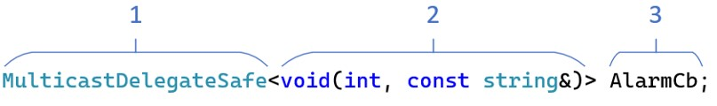
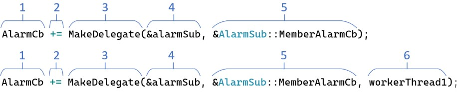
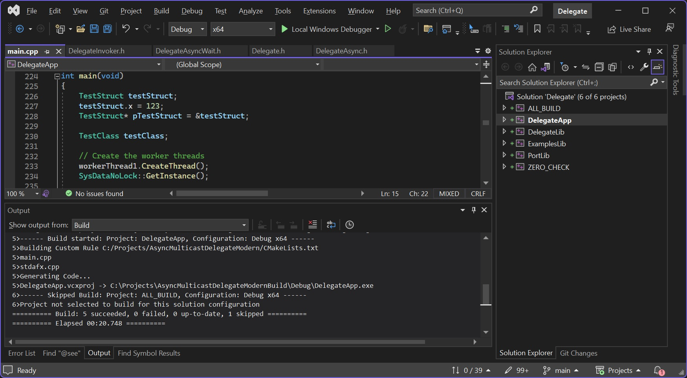
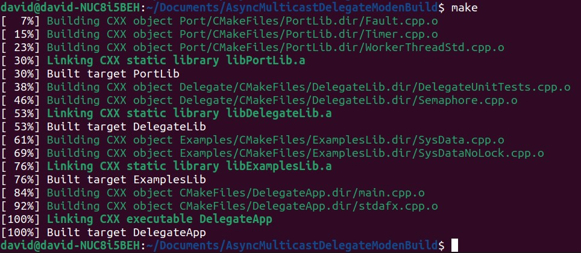

[](https://github.com/endurodave/AsyncMulticastDelegateModern/actions/workflows/cmake_ubuntu.yml)
[](https://github.com/endurodave/AsyncMulticastDelegateModern/actions/workflows/cmake_clang.yml)
[](https://github.com/endurodave/AsyncMulticastDelegateModern/actions/workflows/cmake_windows.yml)

# Asynchronous Multicast Delegates in Modern C++

A C++ delegate library capable of invoking any callable function either synchronously or asynchronously on a user specified thread of control. 

Asynchronous function calls support both non-blocking and blocking modes with a timeout. The library supports all types of target functions, including free functions, class member functions, static class functions, lambdas, and `std::function`. It is capable of handling any function signature, regardless of the number of arguments or return value. All argument types are supported, including by value, pointers, pointers to pointers, and references. The delegate library takes care of the intricate details of function invocation across thread boundaries. Thread-safe delegate containers stores delegate instances with a matching function signature.

Originally published on CodeProject at: <a href="https://www.codeproject.com/Articles/5277036/Asynchronous-Multicast-Delegates-in-Modern-Cpluspl">Asynchronous Multicast Delegates in Modern C++</a>

# Quick Start

A simple publish/subscribe asynchronous delegate example.

## Publisher Example

Typically a delegate is inserted into a delegate container. <code>AlarmCd</code> is a delegate container. 

<figure>
    
    <figcaption>Figure 1: AlarmCb Delegate Container</figcaption>
</figure>

<p></p>

1. <code>MulticastDelegateSafe</code> - the delegate container type.
2. <code>void(int, const string&)</code> - the function signature accepted by the delegate container. Any function matching can be inserted, such as a class member, static or lambda function.
3. <code>AlarmCb</code> - the delegate container name. 

<p>Invoke delegate container to notify subscribers.</p>

```cpp
MulticastDelegateSafe<void(int, const string&)> AlarmCb;

void NotifyAlarmSubscribers(int alarmId, const string& note)
{
    // Invoke delegate to generate callback(s) to subscribers
    AlarmCb(alarmId, note);
}
```
## Subscriber Example

<p>Typically a subscriber registers with a delegate container instance to receive callbacks, either synchronously or asynchronously.</p>

<figure>
    
    <figcaption>Figure 2: Insert into AlarmCb Delegate Container</figcaption>
</figure>

<p></p>

1. <code>AlarmCb</code> - the publisher delegate container instance.
2. <code>+=</code> - add a function target to the container. 
3. <code>MakeDelegate</code> - creates a delegate instance.
4. <code>&alarmSub</code> - the subscriber object pointer.
5. <code>&AlarmSub::MemberAlarmCb</code> - the subscriber callback member function.
6. <code>workerThread1</code> - the thread the callback will be invoked on. Adding a thread argument changes the callback type from synchronous to asynchronous.

<p>Create a function conforming to the delegate signature. Insert a callable functions into the delegate container.</p>

```cpp
class AlarmSub
{
    void AlarmSub()
    {
        // Register to receive callbacks on workerThread1
        AlarmCb += MakeDelegate(this, &AlarmSub::HandleAlarmCb, workerThread1);
    }

    void ~AlarmSub()
    {
        // Unregister from callbacks
        AlarmCb -= MakeDelegate(this, &AlarmSub::HandleAlarmCb, workerThread1);
    }

    void HandleAlarmCb(int alarmId, const string& note)
    {
        // Handle callback here. Called on workerThread1 context.
    }
}
```

<p>This is a simple example. Many other usage patterns exist including asynchronous API's, blocking delegates with a timeout, and more.</p>

## All Delegate Types Example

A example delegate container inserting and removing all delegate types.

```cpp
WorkerThread workerThread1("WorkerThread1");

static int callCnt = 0;

void FreeFunc(int value) {
    cout << "FreeFunc " << value << " " << ++callCnt << endl;
}

// Simple test invoking all target types
void TestAllTargetTypes() {
    class Class {
    public:
        static void StaticFunc(int value) {
            cout << "StaticFunc " << value << " " << ++callCnt << endl;
        }

        void MemberFunc(int value) {
            cout << "MemberFunc " << value << " " << ++callCnt << endl;
        }

        void MemberFuncConst(int value) const {
            cout << "MemberFuncConst " << value << " " << ++callCnt << endl;
        }
    };

    int stackVal = 100;
    std::function<void(int)> LambdaCapture = [stackVal](int i) {
        std::cout << "LambdaCapture " << i + stackVal << " " << ++callCnt << endl;
    };

    std::function<void(int)> LambdaNoCapture = [](int i) {
        std::cout << "LambdaNoCapture " << i << " " << ++callCnt << endl;
    };

    std::function<void(int)> LambdaForcedCapture = +[](int i) {
        std::cout << "LambdaForcedCapture " << i << " " << ++callCnt << endl;
    };

    Class testClass;
    std::shared_ptr<Class> testClassSp = std::make_shared<Class>();

    // Create a multicast delegate container that accepts Delegate<void(int)> delegates.
    // Any function with the signature "void Func(int)".
    MulticastDelegateSafe<void(int)> delegateA;

    // Add all callable function targets to the delegate container
    // Synchronous delegates
    delegateA += MakeDelegate(&FreeFunc);
    delegateA += MakeDelegate(LambdaCapture);
    delegateA += MakeDelegate(LambdaNoCapture);
    delegateA += MakeDelegate(LambdaForcedCapture);
    delegateA += MakeDelegate(&Class::StaticFunc);
    delegateA += MakeDelegate(&testClass, &Class::MemberFunc);
    delegateA += MakeDelegate(&testClass, &Class::MemberFuncConst);
    delegateA += MakeDelegate(testClassSp, &Class::MemberFunc);
    delegateA += MakeDelegate(testClassSp, &Class::MemberFuncConst);

    // Asynchronous delegates
    delegateA += MakeDelegate(&FreeFunc, workerThread1);
    delegateA += MakeDelegate(LambdaCapture, workerThread1);
    delegateA += MakeDelegate(LambdaNoCapture, workerThread1);
    delegateA += MakeDelegate(LambdaForcedCapture, workerThread1);
    delegateA += MakeDelegate(&Class::StaticFunc, workerThread1);
    delegateA += MakeDelegate(&testClass, &Class::MemberFunc, workerThread1);
    delegateA += MakeDelegate(&testClass, &Class::MemberFuncConst, workerThread1);
    delegateA += MakeDelegate(testClassSp, &Class::MemberFunc, workerThread1);
    delegateA += MakeDelegate(testClassSp, &Class::MemberFuncConst, workerThread1);

    // Asynchronous blocking delegates
    delegateA += MakeDelegate(&FreeFunc, workerThread1, WAIT_INFINITE);
    delegateA += MakeDelegate(LambdaCapture, workerThread1, WAIT_INFINITE);
    delegateA += MakeDelegate(LambdaNoCapture, workerThread1, WAIT_INFINITE);
    delegateA += MakeDelegate(LambdaForcedCapture, workerThread1, WAIT_INFINITE);
    delegateA += MakeDelegate(&Class::StaticFunc, workerThread1, WAIT_INFINITE);
    delegateA += MakeDelegate(&testClass, &Class::MemberFunc, workerThread1, WAIT_INFINITE);
    delegateA += MakeDelegate(&testClass, &Class::MemberFuncConst, workerThread1, WAIT_INFINITE);
    delegateA += MakeDelegate(testClassSp, &Class::MemberFunc, workerThread1, WAIT_INFINITE);
    delegateA += MakeDelegate(testClassSp, &Class::MemberFuncConst, workerThread1, WAIT_INFINITE);

    // Invoke all callable function targets stored within the delegate container
    if (delegateA)
        delegateA(123);

    // Wait for async callbacks to complete
    std::this_thread::sleep_for(std::chrono::milliseconds(100));

    // Remove all callable function targets from the delegate container
    // Synchronous delegates
    delegateA -= MakeDelegate(&FreeFunc);
    delegateA -= MakeDelegate(LambdaCapture);
    delegateA -= MakeDelegate(LambdaNoCapture);
    delegateA -= MakeDelegate(LambdaForcedCapture);
    delegateA -= MakeDelegate(&Class::StaticFunc);
    delegateA -= MakeDelegate(&testClass, &Class::MemberFunc);
    delegateA -= MakeDelegate(&testClass, &Class::MemberFuncConst);
    delegateA -= MakeDelegate(testClassSp, &Class::MemberFunc);
    delegateA -= MakeDelegate(testClassSp, &Class::MemberFuncConst);

    // Asynchronous delegates
    delegateA -= MakeDelegate(&FreeFunc, workerThread1);
    delegateA -= MakeDelegate(LambdaCapture, workerThread1);
    delegateA -= MakeDelegate(LambdaNoCapture, workerThread1);
    delegateA -= MakeDelegate(LambdaForcedCapture, workerThread1);
    delegateA -= MakeDelegate(&Class::StaticFunc, workerThread1);
    delegateA -= MakeDelegate(&testClass, &Class::MemberFunc, workerThread1);
    delegateA -= MakeDelegate(&testClass, &Class::MemberFuncConst, workerThread1);
    delegateA -= MakeDelegate(testClassSp, &Class::MemberFunc, workerThread1);
    delegateA -= MakeDelegate(testClassSp, &Class::MemberFuncConst, workerThread1);

    // Asynchronous blocking delegates
    delegateA -= MakeDelegate(&FreeFunc, workerThread1, WAIT_INFINITE);
    delegateA -= MakeDelegate(LambdaCapture, workerThread1, WAIT_INFINITE);
    delegateA -= MakeDelegate(LambdaNoCapture, workerThread1, WAIT_INFINITE);
    delegateA -= MakeDelegate(LambdaForcedCapture, workerThread1, WAIT_INFINITE);
    delegateA -= MakeDelegate(&Class::StaticFunc, workerThread1, WAIT_INFINITE);
    delegateA -= MakeDelegate(&testClass, &Class::MemberFunc, workerThread1, WAIT_INFINITE);
    delegateA -= MakeDelegate(&testClass, &Class::MemberFuncConst, workerThread1, WAIT_INFINITE);
    delegateA -= MakeDelegate(testClassSp, &Class::MemberFunc, workerThread1, WAIT_INFINITE);
    delegateA -= MakeDelegate(testClassSp, &Class::MemberFuncConst, workerThread1, WAIT_INFINITE);

    ASSERT_TRUE(delegateA.Size() == 0);
    ASSERT_TRUE(callCnt == 27);
}
```

## Asynchronous API Example

`SetSystemModeAsyncAPI()` is an asynchronous function call that re-invokes on `workerThread2` if necessary. 

```cpp
void SysDataNoLock::SetSystemModeAsyncAPI(SystemMode::Type systemMode)
{
	// Is the caller executing on workerThread2?
	if (workerThread2.GetThreadId() != WorkerThread::GetCurrentThreadId())
	{
		// Create an asynchronous delegate and re-invoke the function call on workerThread2
		MakeDelegate(this, &SysDataNoLock::SetSystemModeAsyncAPI, workerThread2).AsyncInvoke(systemMode);
		return;
	}

	// Create the callback data
	SystemModeChanged callbackData;
	callbackData.PreviousSystemMode = m_systemMode;
	callbackData.CurrentSystemMode = systemMode;

	// Update the system mode
	m_systemMode = systemMode;

	// Callback all registered subscribers
	if (SystemModeChangedDelegate)
		SystemModeChangedDelegate(callbackData);
}
```

# Delegate Classes

Primary delegate library classes.

```cpp
// Delegates
DelegateBase
    Delegate<>
        DelegateFree<>
            DelegateFreeAsync<>
                DelegateFreeAsyncWait<>
        DelegateMember<>
            DelegateMemberAsync<>
                DelegateMemberAsyncWait<>
        DelegateMemberSp<>
            DelegateMemberSpAsync<>
                DelegateMemberSpAsyncWait<>
        DelegateFunction<>
            DelegateFunctionAsync<>
                DelegateFunctionAsyncWait<>

// Delegate Containers
SinglecastDelegate<>
MulticastDelegate<>
    MulticastDelegateSafe<>

// Helper Classes
IDelegateInvoker
DelegateMsg
DelegateThread
``` 

# Project Build

<a href="https://www.cmake.org">CMake</a> is used to create the build files. CMake is free and open-source software. Windows, Linux and other toolchains are supported. Example CMake console commands executed inside the project root directory: 

## Windows Visual Studio

<code>cmake -G "Visual Studio 17 2022" -A Win32 -B build -S .</code>

<code>cmake -G "Visual Studio 17 2022" -A x64 -B build -S .</code>

<code>cmake -G "Visual Studio 17 2022" -A x64 -B build -S . -DENABLE_ALLOCATOR=ON</code>

After executed, open the Visual Studio project from within the <code>build</code> directory.

<figure>
    
    <figcaption>Figure 3: Visual Studio Build</figcaption>
</figure>

## Linux Make

<code>cmake -G "Unix Makefiles" -B build -S .</code>

<code>cmake -G "Unix Makefiles" -B build -S . -DENABLE_ALLOCATOR=ON</code>

After executed, build the software from within the <code>build</code> directory using the command <code>make</code>. Run the console app using <code>./DelegateApp</code>.

<figure>
    
    <figcaption>Figure 4: Linux Makefile Build</figcaption>
</figure>

# Design Details

 See [Design Details](docs/DETAILS.md) for implementation design details and more examples.

 See [Doxygen Pages](doxygen/html/index.html) for source code documentation.

# Related Repositories

## Source Code Used Within Delegates

Supporting source code within the delegate library.

* <a href="https://github.com/endurodave/StdWorkerThread">C++ std::thread Event Loop</a> - C++ std::thread Event Loop with Message Queue and Timer.
* <a href="https://github.com/endurodave/stl_allocator">Fixed Block std::allocator</a> - STL std::allocator Fixed Block Memory Allocator.

## Projects Using Delegates

The repositories below utilize the delegate library in different multithreaded applications.

* <a href="https://github.com/endurodave/AsyncStateMachine">Asynchronous State Machine Design in C++</a> - an asynchronous C++ state machine implemented using an asynchronous delegate library.
* <a href="https://github.com/endurodave/IntegrationTestFramework">Integration Test Framework using Google Test and Delegates</a> - a multi-threaded C++ software integration test framework using Google Test and Delegate libraries.
* <a href="https://github.com/endurodave/Async-SQLite">Asynchronous SQLite API using C++ Delegates</a> - an asynchronous SQLite wrapper implemented using an asynchronous delegate library.

# Star History

Find this repository useful? Consider giving it a star!

[](https://star-history.com/#endurodave/AsyncMulticastDelegateModern&Date)


