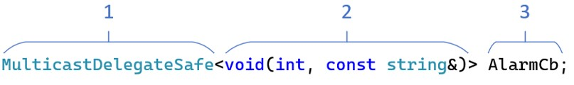
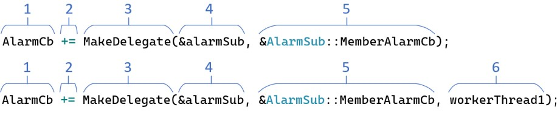

# Asynchronous Multicast Delegates in Modern C++
A C++ standards compliant delegate library capable of targeting any callable function synchronously or asynchronously.

Originally published on CodeProject at: <a href="https://www.codeproject.com/Articles/5277036/Asynchronous-Multicast-Delegates-in-Modern-Cpluspl"><strong>Asynchronous Multicast Delegates in Modern C++</strong></a>

<h2>Preface</h2>

<p>Asynchronous function invocation allows for easy movement of data between threads. The table below summarizes the various asynchronous function invocation implementations available in C and C++.</p>

| Repository                                                                                            | Language | Key Delegate Features                                                                                                                                                                                                               | Notes                                                                                                                                                                                                      |
|-------------------------------------------------------------------------------------------------------|----------|-------------------------------------------------------------------------------------------------------------------------------------------------------------------------------------------------------------------------------------|------------------------------------------------------------------------------------------------------------------------------------------------------------------------------------------------------------|
| <a href="https://github.com/endurodave/AsyncMulticastDelegateModern">AsyncMulticastDelegateModern</a> | C++17    | * Function-like template syntax<br> * Any delegate target function type (member, static, free, lambda)<br>  * N target function arguments<br> * N delegate subscribers<br> * Variadic templates<br> * Template metaprogramming      | * Most generic implementation<br> * Lowest lines of source code<br> * Slowest of all implementations<br> * No fixed block allocator support<br> * No remote delegate support<br> * Complex metaprogramming |
| <a href="https://github.com/endurodave/AsyncMulticastDelegateCpp17">AsyncMulticastDelegateCpp17</a>   | C++17    | * Function-like template syntax<br> * Any delegate target function type (member, static, free, lambda)<br> * 5 target function arguments<br> * N delegate subscribers<br> * Optional fixed block allocator<br> * Variadic templates | * Selective compile using constexpr<br> * Avoids complex metaprogramming<br> * Faster than AsyncMulticastDelegateModern<br> * No remote delegate support                                                   |
| <a href="https://github.com/endurodave/AsyncMulticastDelegateCpp11">AsyncMulticastDelegateCpp11</a>   | C++11    | * Function-like template syntax<br> * Any delegate target function type (member, static, free, lambda)<br> * 5 target function arguments<br> * N delegate subscribers<br> * Optional fixed block allocator                          | * High lines of source code<br> * Highly repetitive source code                                                                                                                                            |
| <a href="https://github.com/endurodave/AsyncMulticastDelegate">AsyncMulticastDelegate</a>             | C++03    | * Traditional template syntax<br> * Any delegate target function type (member, static, free)<br> * 5 target function arguments<br> * N delegate subscribers<br> * Optional fixed block allocator                                    | * High lines of source code<br> * Highly repetitive source code                                                                                                                                            |
| <a href="https://github.com/endurodave/AsyncCallback">AsyncCallback</a>                               | C++      | * Traditional template syntax<br> * Delegate target function type (static, free)<br> * 1 target function argument<br> * N delegate subscribers                                                                                      | * Low lines of source code<br> * Most compact C++ implementation<br> * Any C++ compiler                                                                                                                    |
| <a href="https://github.com/endurodave/C_AsyncCallback">C_AsyncCallback</a>                           | C        | * Macros provide type-safety<br> * Delegate target function type (static, free)<br> * 1 target function argument<br> * Fixed delegate subscribers (set at compile time)<br> * Optional fixed block allocator                        | * Low lines of source code<br> * Very compact implementation<br> * Any C compiler                                                                                                                          |

<p>This article documents a modern C++ implementation of asynchronous delegates. The library implements anonymous synchronous and asynchronous function callbacks. The target function is invoked with all arguments on the registrar 's desired thread of control.</p>

<p>The previous article I wrote entitled "<a href="https://www.codeproject.com/Articles/1160934/Asynchronous-Multicast-Delegates-in-Cplusplus">Asynchronous Multicast Delegates in C++</a>" built under C++03. This "modern" version uses C++17 features. Variadic templates and template metaprogramming improve library usability and significantly reduces the source code line count. While the basic idea between the articles is similar, this new version is a complete re-write.</p>

<p>I've created four versions of the "asynchronous callback" idea; three C++ versions and one C version. See the <strong>References</strong> section at the end of the article for links to the other implementations.</p>

<h2>Introduction</h2>

<p>Nothing seems to garner the interest of C++ programmers more than delegates. In other languages, the delegate is a first-class feature so developers can use these well-understood constructs. In C++, however, a delegate is not natively available. Yet that doesn't stop us programmers from trying to emulate the ease with which a delegate stores and invokes any callable function.</p>

<p>Delegates normally support synchronous executions, that is, when invoked; the bound function is executed within the caller's thread of control. On multi-threaded applications, it would be ideal to specify the target function and the thread it should execute on without imposing function signature limitations. The library does the grunt work of getting the delegate and all argument data onto the destination thread. The idea behind this article is to provide a C++ delegate library with a consistent API that is capable of synchronous and asynchronous invocations on any callable function.</p>

<p>The features of the modern C++ delegate library are:</p>

<ol>
	<li><strong>Any Compiler</strong> &ndash; standard C++17 code for any compiler without weird hacks</li>
	<li><strong>Any Function</strong> &ndash; invoke any callable function: member, static, or free</li>
	<li><strong>Any Argument Type</strong> &ndash; supports any argument type: value, reference, pointer, pointer to pointer</li>
	<li><strong>Multiple Arguments</strong> &ndash; supports N number of function arguments for the bound function</li>
	<li><strong>Synchronous Invocation</strong> &ndash; call the bound function synchronously</li>
	<li><strong>Asynchronous Invocation</strong> &ndash; call the bound function asynchronously on a client specified thread</li>
	<li><strong>Blocking Asynchronous Invocation</strong> - invoke asynchronously using blocking or non-blocking delegates</li>
	<li><strong>Smart Pointer Support</strong> - bind an instance function using a raw object pointer or <code>std::shared_ptr</code></li>
    <li><strong>Lambda Support</strong> - bind and invoke lambda functions asynchronously using delegates.</li>
	<li><strong>Automatic Heap Handling</strong> &ndash; automatically copy argument data to the heap for safe transport through a message queue</li>
	<li><strong>Any OS</strong> &ndash; easy porting to any OS. C++11 <code>std::thread</code> port included</li>
    <li><strong>32/64-bit</strong> - Support for 32 and 64-bit projects.</li>
	<li><strong>CMake Build</strong> - CMake supports most toolchains</li>
	<li><strong>Unit Tests</strong> - extensive unit testing of the delegate library included</li>
	<li><strong>No External Libraries</strong> &ndash; delegate does not rely upon external libraries</li>
	<li><strong>Ease of Use</strong> &ndash; function signature template arguments (e.g., <code>MulticastDelegate<void(TestStruct*)></code>)</li>
</ol>

<p>The delegate implementation significantly eases multithreaded application development by executing the delegate function with all of the function arguments on the thread of control that you specify. The framework handles all of the low-level machinery to safely invoke any function signature on a target thread. Windows 2017 and Eclipse projects are included for easy experimentation.</p>

<h2>Delegates Background</h2>

<p>If you're not familiar with a delegate, the concept is quite simple. A delegate can be thought of as a super function pointer. In C++, there 's no pointer type capable of pointing to all the possible function variations: instance member, virtual, const, static, and free (global). A function pointer can't point to instance member functions, and pointers to member functions have all sorts of limitations. However, delegate classes can, in a type-safe way, point to any function provided the function signature matches. In short, a delegate points to any function with a matching signature to support anonymous function invocation.</p>

<p>In practice, while a delegate is useful, a multicast version significantly expands its utility. The ability to bind more than one function pointer and sequentially invoke all registrars' makes for an effective publisher/subscriber mechanism. Publisher code exposes a delegate container and one or more anonymous subscribers register with the publisher for callback notifications.</p>

<p>The problem with callbacks on a multithreaded system, whether it be a delegate-based or function pointer based, is that the callback occurs synchronously. Care must be taken that a callback from another thread of control is not invoked on code that isn't thread-safe. Multithreaded application development is hard. It 's hard for the original designer; it 's hard because engineers of various skill levels must maintain the code; it 's hard because bugs manifest themselves in difficult ways. Ideally, an architectural solution helps to minimize errors and eases application development.</p>

<p>This C++ delegate implementation is full featured and allows calling any function, even instance member functions, with any arguments either synchronously or asynchronously. The delegate library makes binding to and invoking any function a snap.</p>

<h2>Quick Start</h2>

A simple publish/subscribe asynchronous delegate example.

<h3>Publisher</h3>

Typically a delegate is inserted into a delegate container. <code>AlarmCd</code> is a delegate container. 

<figure>
    
    <figcaption>Figure 1: AlarmCb Delegate Container</figcaption>
</figure>

<p></p>

1. <code>MulticastDelegateSafe</code> - the delegate container type.
2. <code>void(int, const string&)</code> - the function signature accepted by the delegate container. Any function matching can be inserted, such as class a member, static or lambda function.
3. <code>AlarmCb</code> - the delegate container name. 

<p>Invoke delegate container to notify subscribers.</p>

```cpp
MulticastDelegateSafe<void(int, const string&)> AlarmCb;

void NotifyAlarmSubscribers(int alarmId, const string& note)
{
    // Invoke delegate to generate callback(s) to subscribers
    AlarmCb(alarmId, note);
}
```
<h3>Subscriber</h3>

<p>Typically a subscriber registers with a delegate container instance to receive callbacks, either synchronously or asynchronously.</p>

<figure>
    
    <figcaption>Figure 2: Insert into AlarmCb Delegate Container</figcaption>
</figure>

<p></p>

1. <code>AlarmCb</code> - the publisher delegate container instance.
2. <code>+=</code> - add a function target to the container. 
3. <code>MakeDelegate</code> - creates a delegate instance.
4. <code>&alarmSub</code> - an object pointer.
5. <code>AlarmSub::MemberAlarmCb</code> - a pointer to a callback member function.
6. <code>workerThread1</code> - the thread the callback will be invoked on. Adding a thread argument changes the callback from synchronous to asynchronous.

<p>Create a function conforming to the delegate signature. Insert a callable functions into the delegate container.</p>

```cpp
class AlarmSub
{
    void AlarmSub()
    {
        // Register to receive callbacks on workerThread1
        AlarmCb += MakeDelegate(this, &Alarm::HandleAlarmCb, workerThread1);
    }

    void ~AlarmSub()
    {
        // Unregister from callbacks
        AlarmCb -= MakeDelegate(this, &Alarm::HandleAlarmCb, workerThread1);
    }

    void HandleAlarmCb(int alarmId, const string& note)
    {
        // Handle callback here called on workerThread1
    }
}
```

<p>This is a simple example. Many other usage patterns exist including creating asynchronous API's and more.</p>

<h2>Project Build</h2>

CMake (cmake.com) is used to create the build files. Windows, Linux and many other toolchains are supported. Example console CMake commands: 

<h3>Windows Visual Studio</h3>

cmake -G "Visual Studio 17 2022" -A Win32 -B ../AsyncMulticastDelegateModernBuild -S .

cmake -G "Visual Studio 17 2022" -A x64 -B ../AsyncMulticastDelegateModernBuild -S .

cmake -G "Visual Studio 17 2022" -A x64 -B ../AsyncMulticastDelegateModernBuild -S . -DENABLE_UNIT_TESTS=ON

<h3>Linux Make</h3>

cmake -G "Unix Makefiles" -B ../AsyncMulticastDelegateModernBuild -S .

cmake -G "Unix Makefiles" -B ../AsyncMulticastDelegateModernBuild -S . -DENABLE_UNIT_TESTS=ON

<h2>Using the Code</h2>

<p>I'll first present how to use the code, and then get into the implementation details.</p>

<p>The delegate library is comprised of delegates and delegate containers. A delegate is capable of binding to a single callable function. A multicast delegate container holds one or more delegates in a list to be invoked sequentially. A single cast delegate container holds at most one delegate.</p>

<p>The primary delegate classes are listed below:</p>

<ul class="class">
	<li><code>DelegateFree<></code></li>
	<li><code>DelegateFreeAsync<></code></li>
	<li><code>DelegateFreeAsyncWait<></code></li>
	<li><code>DelegateMember<></code></li>
	<li><code>DelegateMemberAsync<></code></li>
	<li><code>DelegateMemberAsyncWait<></code></li>
	<li><code>DelegateMemberSp<></code></li>
	<li><code>DelegateMemberSpAsync<></code></li>
</ul>

<p><code>DelegateFree<></code> binds to a free or static member function. <code>DelegateMember<> </code>binds to a class instance member function. <code>DelegateMemberSp<></code> binds to a class instance member function using a <code>std::shared_ptr</code> instead of a raw object pointer. All versions offer synchronous function invocation.</p>

<p><code>DelegateFreeAsync<></code>, <code>DelegateMemberAsync<></code> and <code>DelegateMemberSpAsync<></code> operate in the same way as their synchronous counterparts; except these versions offer non-blocking asynchronous function execution on a specified thread of control.</p>

<p><code>DelegateFreeAsyncWait<></code> and <code>DelegateMemberAsyncWait<></code> provides blocking asynchronous function execution on a target thread with a caller supplied maximum wait timeout.</p>

<p>The three main delegate container classes are:</p>

<ul class="class">
	<li><code>SinglecastDelegate<></code></li>
	<li><code>MulticastDelegate<></code></li>
	<li><code>MulticastDelegateSafe<></code></li>
</ul>

<p><code>SinglecastDelegate<></code> is a delegate container accepting a single delegate. The advantage of the single cast version is that it is slightly smaller and allows a return type other than <code>void</code> in the bound function.</p>

<p><code>MulticastDelegate<></code> is a delegate container implemented as a singly-linked list accepting multiple delegates. Only a delegate bound to a function with a <code>void</code> return type may be added to a multicast delegate container.</p>

<p><code>MultcastDelegateSafe<></code> is a thread-safe container implemented as a singly-linked list accepting multiple delegates. Always use the thread-safe version if multiple threads access the container instance.</p>

<p>Each container stores the delegate by value. This means the delegate is copied internally into either heap or fixed block memory depending on the mode. The user is not required to manually create a delegate on the heap before insertion into the container. Typically, the overloaded template function <code>MakeDelegate() </code>is used to create a delegate instance based upon the function arguments.</p>

<h3>Synchronous Delegates</h3>

<p>All delegates are created with the overloaded <code>MakeDelegate()</code> template function. The compiler uses template argument deduction to select the correct <code>MakeDelegate()</code> version eliminating the need to manually specify the template arguments. For example, here is a simple free function.</p>

```cpp
void FreeFuncInt(int value)
{
      cout << "FreeCallback " << value << endl;
}
```

<p>To bind the free function to a delegate, create a <code>DelegateFree<void(int)></code> instance using <code>MakeDelegate()</code>. The <code>DelegateFree </code>template argument is the complete function's signature: <code>void(int)</code>. <code>MakeDelegate()</code> returns a <code>DelegateFree<void(int)></code> object and the following line invokes the function <code>FreeFuncInt</code> using the delegate.</p>

```cpp
// Create a delegate bound to a free function then invoke
DelegateFree<void(int)> delegateFree = MakeDelegate(&FreeFuncInt);
delegateFree(123);
```

<p>A member function is bound to a delegate in the same way, only this time <code>MakeDelegate()</code> uses two arguments: a class instance and a member function pointer. The two <code>DelegateMember </code>template arguments are the class name (i.e., <code>TestClass</code>) and the bound function signature (i.e. <code>void(TestStruct*)</code>).</p>

```cpp
// Create a delegate bound to a member function then invoke    
DelegateMember<TestClass, void(TestStruct*)> delegateMember = 
      MakeDelegate(&testClass, &TestClass::MemberFunc);    
delegateMember(&testStruct);
```

<p>Rather than create a concrete free or member delegate, typically a delegate container is used to hold one or more delegates. A delegate container can hold any delegate type. For example, a multicast delegate container that binds to any function with a <code>void (int)</code> function signature is shown below:</p>

```cpp
MulticastDelegate<void(int)> delegateA;
```

<p>A single cast delegate is created in the same way:</p>

```cpp
SinglecastDelegate<void(int)> delegateB;
```

<p>A function signature that returns a value is also possible. The delegate container accepts functions with one <code>float </code>argument and returns an <code>int</code>.</p>

```cpp
SinglecastDelegate<int(float)> delegateC;
```

<p>A <code>SinglecastDelegate<></code> may bind to a function that returns a value whereas a multicast versions cannot. The reason is that when multiple callbacks are invoked, which callback function return value should be used? The correct answer is none, so multicast containers only accept delegates with function signatures using <code>void </code>as the return type.</p>

<p><code>MulticastDelegate </code>containers bind to one or more functions.</p>

```cpp
MulticastDelegate<void(int, int)> delegateD;

MulticastDelegate<void(float, int, char)> delegateE;
```

<p>Of course, more than just built-in pass by value argument types are supported.</p>

```cpp
MulticastDelegate<void(const MyClass&, MyStruct*, Data**)> delegateF;
```

<p>Creating a delegate instance and adding it to the multicast delegate container is accomplished with the overloaded <code>MakeDelegate()</code> function and <code>operator+=</code>. Binding a free function or <code>static</code> function only requires a single function pointer argument.</p>

```cpp
delegateA += MakeDelegate(&FreeFuncInt);
```

<p>An instance member function can also be added to any delegate container. For member functions, the first argument to <code>MakeDelegate()</code> is a pointer to the class instance. The second argument is a pointer to the member function.</p>

```cpp
delegateA += MakeDelegate(&testClass, &TestClass::MemberFunc);
```

<p>Check for registered clients first, and then invoke callbacks for all registered delegates. If multiple delegates are stored within <code>MulticastDelegate<void(int)></code>, each one is called sequentially.</p>

```cpp
// Invoke the delegate target functions
if (delegateA)
      delegateA(123);
```

<p>Removing a delegate instance from the delegate container uses <code>operator-=</code>.</p>

```cpp
delegateA -= MakeDelegate(&FreeFuncInt);
```

<p>Alternatively, <code>Clear()</code> is used to remove all delegates within the container.</p>

```cpp
delegateA.Clear();
```

<p>A delegate is added to the single cast container using <code>operator=</code>.</p>

```cpp
SinglecastDelegate<int(int)> delegateF;
delegateF = MakeDelegate(&FreeFuncIntRetInt);
```

<p>Removal is with <code>Clear()</code> or assigning <code>0</code>.</p>

```cpp
delegateF.Clear();
delegateF = 0;
```

<h3>Asynchronous Non-Blocking Delegates</h3>

<p>Up until this point, the delegates have all been synchronous. The asynchronous features are layered on top of the synchronous delegate implementation. To use asynchronous delegates, a thread-safe delegate container safely accessible by multiple threads is required. Locks protect the class API against simultaneous access. The "<code>Safe</code>" version is shown below.</p>

```cpp
MulticastDelegateSafe<void(TestStruct*)> delegateC;
```

<p>A thread pointer as the last argument to <code>MakeDelegate()</code> forces creation of an asynchronous delegate. In this case, adding a thread argument causes <code>MakeDelegate()</code> to return a <code>DelegateMemberAsync<></code> as opposed to <code>DelegateMember<></code>.</p>

```cpp
delegateC += MakeDelegate(&testClass, &TestClass::MemberFunc, workerThread1);
```

<p>Invocation is the same as the synchronous version, yet this time the callback function <code>TestClass::MemberFunc()</code> is called from <code>workerThread1</code>.</p>

```cpp
if (delegateC)
      delegateC(&testStruct);
```

<p>Here is another example of an asynchronous delegate being invoked on <code>workerThread1 </code>with <code>std::string</code> and <code>int </code>arguments.</p>

```cpp
// Create delegate with std::string and int arguments then asynchronously    
// invoke on a member function
MulticastDelegateSafe<void(const std::string&, int)> delegateH;
delegateH += MakeDelegate(&testClass, &TestClass::MemberFuncStdString, workerThread1);
delegateH("Hello world", 2020);
```

<p>Usage of the library is consistent between synchronous and asynchronous delegates. The only difference is the addition of a thread pointer argument to <code>MakeDelegate()</code>. Always remember to use the thread-safe <code>MulticastDelegateSafe<></code> containers when using asynchronous delegates to callback across thread boundaries.</p>

<p>The default behavior of the delegate library when invoking non-blocking asynchronous delegates is that arguments are copied into heap memory for safe transport to the destination thread. This means all arguments will be duplicated. If your data is something other than plain old data (POD) and can't be bitwise copied, then be sure to implement an appropriate copy constructor to handle the copying yourself.</p>

<p>For more examples, see <em>main.cpp</em> and <em>DelegateUnitTests.cpp</em> within the attached source code.</p>

<h3>Bind to std::shared_ptr</h3>

<p>Binding to instance member function requires a pointer to an object. The delegate library supports binding with a raw pointer and a <code>std::shared_ptr</code> smart pointer. Usage is what you'd expect; just use a <code>std::shared_ptr</code> in place of the raw object pointer in the call to <code>MakeDelegate()</code>. Depending on if a thread argument is passed to <code>MakeDelegate()</code> or not, a <code>DelegateMemberSp<></code> or <code>DelegateMemberSpAsync<></code> instance is returned.</p>

```cpp
// Create a shared_ptr, create a delegate, then synchronously invoke delegate function
std::shared_ptr<TestClass> spObject(new TestClass());
auto delegateMemberSp = MakeDelegate(spObject, &TestClass::MemberFuncStdString);
delegateMemberSp("Hello world using shared_ptr", 2020);
```

<h3>Caution Using Raw Object Pointers</h3>

<p>Certain asynchronous delegate usage patterns can cause a callback invocation to occur on a deleted object. The problem is this: an object function is bound to a delegate and invoked asynchronously, but before the invocation occurs on the target thread, the target object is deleted. In other words, it is possible for an object bound to a delegate to be deleted before the target thread message queue has had a chance to invoke the callback. The following code exposes the issue:</p>

```cpp
    // Example of a bug where the testClassHeap is deleted before the asychronous delegate
    // is invoked on the workerThread1. In other words, by the time workerThread1 calls
    // the bound delegate function the testClassHeap instance is deleted and no longer valid.
    TestClass* testClassHeap = new TestClass();
    auto delegateMemberAsync = 
           MakeDelegate(testClassHeap, &TestClass::MemberFuncStdString, workerThread1);
    delegateMemberAsync("Function async invoked on deleted object. Bug!", 2020);
    delegateMemberAsync.Clear();
    delete testClassHeap;
```

<p>The example above is contrived, but it does clearly show that nothing prevents an object being deleted while waiting for the asynchronous invocation to occur. In many embedded system architectures, the registrations might occur on singleton objects or objects that have a lifetime that spans the entire execution. In this way, the application's usage pattern prevents callbacks into deleted objects. However, if objects pop into existence, temporarily subscribe to a delegate for callbacks, then get deleted later the possibility of a latent delegate stuck in a message queue could invoke a function on a deleted object.</p>

<p>Fortunately, C++ smart pointers are just the ticket to solve these complex object lifetime issues. A <code>DelegateMemberSpAsync<></code> delegate binds using a <code>std::shared_ptr</code> instead of a raw object pointer. Now that the delegate has a shared pointer, the danger of the object being prematurely deleted is eliminated. The shared pointer will only delete the object pointed to once all references are no longer in use. In the code snippet below, all references to <code>testClassSp </code>are removed by the client code yet the delegate's copy placed into the queue prevents <code>TestClass </code>deletion until after the asynchronous delegate callback occurs.</p>

```cpp
    // Example of the smart pointer function version of the delegate. The testClassSp instance
    // is only deleted after workerThread1 invokes the callback function thus solving the bug.
    std::shared_ptr<TestClass> testClassSp(new TestClass());
    auto delegateMemberSpAsync = MakeDelegate
         (testClassSp, &TestClass::MemberFuncStdString, workerThread1);
    delegateMemberSpAsync("Function async invoked using smart pointer. Bug solved!", 2020);
    delegateMemberSpAsync.Clear();
    testClassSp.reset();
```

<p>Actually, this technique can be used to call an object function, and then the object automatically deletes after the callback occurs. Using the above example, create a shared pointer instance, bind a delegate, and invoke the delegate. Now <code>testClassSp</code> can go out of scope and <code>TestClass::MemberFuncStdString</code> will still be safely called on <code>workerThread1</code>. The <code>TestClass </code>instance will delete by way of <code>std::shared_ptr<TestClass></code> once the smart pointer reference count goes to 0 after the callback completes without any extra programmer involvement.</p>

```cpp
std::shared_ptr<TestClass> testClassSp(new TestClass());
auto delegateMemberSpAsync =
    MakeDelegate(testClassSp, &TestClass::MemberFuncStdString, workerThread1);
delegateMemberSpAsync("testClassSp deletes after delegate invokes", 2020);
```

<h3>Asynchronous Blocking Delegates</h3>

<p>A blocking delegate waits until the target thread executes the bound delegate function. Unlike non-blocking delegates, the blocking versions do not copy argument data onto the heap. They also allow function return types other than <code>void</code> whereas the non-blocking delegates only bind to functions returning <code>void</code>. Since the function arguments are passed to the destination thread unmodified, the function executes just as you 'd expect a synchronous version including incoming/outgoing pointers and references.</p>

<p>Stack arguments passed by pointer/reference need not be thread-safe. The reason is that the calling thread blocks waiting for the destination thread to complete. This means that the delegate implementation guarantees only one thread is able to access stack allocated argument data.</p>

<p>A blocking delegate must specify a timeout in milliseconds or <code>WAIT_INFINITE</code>. Unlike a non-blocking asynchronous delegate, which is guaranteed to be invoked, if the timeout expires on a blocking delegate, the function is not invoked. Use <code>IsSuccess()</code> to determine if the delegate succeeded or not.</p>

<p>Adding a timeout as the last argument to <code>MakeDelegate()</code> causes a <code>DelegateFreeAsyncWait<></code> or <code>DelegateMemberAsyncWait<></code> instance to be returned depending on if a free or member function is being bound. A "<code>Wait</code>" delegate is typically not added to a delegate container. The typical usage pattern is to create a delegate and function arguments on the stack, then invoke. The code fragment below creates a blocking delegate with the function signature <code>int (std::string&</code>). The function is called on <code>workerThread1</code>. The function <code>MemberFuncStdStringRetInt()</code> will update the outgoing <code>string msg</code> and return an integer to the caller.</p>

```cpp
    // Create a asynchronous blocking delegate and invoke. This thread will block until the
    // msg and year stack values are set by MemberFuncStdStringRetInt on workerThread1.
    auto delegateI = 
          MakeDelegate(&testClass, &TestClass::MemberFuncStdStringRetInt, 
                       workerThread1, WAIT_INFINITE);
    std::string msg;
    int year = delegateI(msg);
    if (delegateI.IsSuccess())
    {
        cout << msg.c_str() << " " << year << endl;
    }
```

<h3>Asynchronous Lambda Invocation</h3>

<p>Delegates can invoke non-capturing lambda functions asynchronously. The example below calls <code>LambdaFunc1 </code>on <code>workerThread1</code>. </p>

```cpp
auto LambdaFunc1 = +[](int i) -> int
{
    cout << "Called LambdaFunc1 " << i << std::endl;
    return ++i;
};

// Asynchronously invoke lambda on workerThread1 and wait for the return value
auto lambdaDelegate1 = MakeDelegate(LambdaFunc1, workerThread1, WAIT_INFINITE);
int lambdaRetVal2 = lambdaDelegate1(123);
```

<p>Delegates are callable and therefore may be passed to the standard library. The example below shows <code>CountLambda </code>executed asynchronously on <code>workerThread1 </code>by <code>std::count_if</code>.</p>

```cpp
std::vector<int> v{ 1, 2, 3, 4, 5, 6, 7, 8, 9 };

auto CountLambda = +[](int v) -> int
{
    return v > 2 && v <= 6;
};
auto countLambdaDelegate = MakeDelegate(CountLambda, workerThread1, WAIT_INFINITE);

const auto valAsyncResult = std::count_if(v.begin(), v.end(),
    countLambdaDelegate);
cout << "Asynchronous lambda result: " << valAsyncResult << endl;
```

<h2>Delegate Library</h2>

<p>The delegate library contains numerous classes. A single include <em>DelegateLib.h</em> provides access to all delegate library features. The library is wrapped within a <code>DelegateLib </code>namespace. Included unit tests help ensure a robust implementation. The table below shows the delegate class hierarchy.</p>


```cpp
DelegateBase
    Delegate<>
        DelegateFree<>
            DelegateFreeAsync<>
                DelegateFreeAsyncWait<>
        DelegateMember<>
            DelegateMemberAsync<>
                DelegateMemberAsyncWait<>
        DelegateMemberSp<>
            DelegateMemberSpAsync<>
``` 
<p><code>DelegateBase</code> is a non-template, abstract base class common to all delegate instances. Comparison operators and a <code>Clone()</code> method define the interface.</p>

```cpp
class DelegateBase {
public:
    virtual ~DelegateBase() {}

    /// Derived class must implement operator== to compare objects.
    virtual bool operator==(const DelegateBase& rhs) const = 0;
    virtual bool operator!=(const DelegateBase& rhs) { return !(*this == rhs); }


    /// Use Clone to provide a deep copy using a base pointer. Covariant
    /// overloading is used so that a Clone() method return type is a
    /// more specific type in the derived class implementations.
    /// @return A dynamic copy of this instance created with operator new.
    /// @post The caller is responsible for deleting the clone instance.
    virtual DelegateBase* Clone() const = 0;
};
```

<p><code>Delegate<></code> provides a template class with templatized function arguments. The <code>operator()</code> function allows invoking the delegate function with the correct function parameters. Covariant overloading of <code>Clone()</code> provides a more specific return type.</p>

<p>The <code>Clone()</code> function is required by the delegate container classes. The delegate container needs to make copies of the delegate for storage into the list. Since the delegate container only knows about abstract base <code>Delegate<></code> instances, it must use the <code>Clone()</code> function when creating a duplicate copy.</p>

```cpp
template <class R>
struct Delegate; // Not defined

template <class RetType, class... Args>
class Delegate<RetType(Args...)> : public DelegateBase {
public:
    virtual RetType operator()(Args... args) = 0;
    virtual Delegate* Clone() const = 0;
};
```

<p><code>RetType </code>is the bound funciton return type. The <code>Args </code>parameter pack is zero or more bound function arguments. <code>operator()</code> invokes the bound function either synchronously or asynchronously depending on the derived class implementation.</p>

<p>Efficiently storing instance member functions and free functions within the same class proves difficult. Instead, two classes were created for each type of bound function. <code>DelegateMember<></code> handles instance member functions. <code>DelegateFree<></code> handles free and static functions.</p>

<p><code>Clone()</code> creates a new instance of the class. <code>Bind()</code> takes a class instance and a member function pointer. The function <code>operator() </code>allows invoking the delegate function assigned with <code>Bind()</code>.</p>

```cpp
template <class C, class R>
struct DelegateMember; // Not defined

template <class TClass, class RetType, class... Args>
class DelegateMember<TClass, RetType(Args...)> : public Delegate<RetType(Args...)> {
public:
    typedef TClass* ObjectPtr;
    typedef RetType(TClass::*MemberFunc)(Args...);
    typedef RetType(TClass::*ConstMemberFunc)(Args...) const;
    using ClassType = DelegateMember<TClass, RetType(Args...)>;

    DelegateMember(ObjectPtr object, MemberFunc func) { Bind(object, func); }
    DelegateMember(ObjectPtr object, ConstMemberFunc func) { Bind(object, func); }
    DelegateMember() = delete;

    /// Bind a member function to a delegate. 
    void Bind(ObjectPtr object, MemberFunc func) {
        m_object = object;
        m_func = func;
    }

    /// Bind a const member function to a delegate. 
    void Bind(ObjectPtr object, ConstMemberFunc func) {
        m_object = object;
        m_func = reinterpret_cast<MemberFunc>(func);
    }

    virtual DelegateMember* Clone() const override { return new DelegateMember(*this); }

    // Invoke the bound delegate function
    virtual RetType operator()(Args... args) override {
        return std::invoke(m_func, m_object, args...);
    }

    virtual bool operator==(const DelegateBase& rhs) const override {
        auto derivedRhs = dynamic_cast<const ClassType*>(&rhs);
        return derivedRhs &&
            m_func == derivedRhs->m_func &&
            m_object == derivedRhs->m_object;
    }

    bool Empty() const { return !(m_object && m_func); }
    void Clear() { m_object = nullptr; m_func = nullptr; }

    explicit operator bool() const { return !Empty(); }

private:
    ObjectPtr m_object = nullptr;	// Pointer to a class object
    MemberFunc m_func = nullptr;   	// Pointer to an instance member function
};
```

<p>Notice <code>std::invoke</code> is used to invoke the bound function within <code>operator()</code>. With the <code>RetVal </code>and <code>Args </code>parameter pack template argument this single <code>DelegateMember </code>class handles all target function signatures.</p>

<p><code>DelegateFree<></code> binds to a free or static member function. Notice it inherits from <code>Delegate<></code> just like <code>DelegateMember<></code>. <code>Bind()</code> takes a function pointer and <code>operator()</code> allows subsequent invocation of the bound function.</p>

```cpp
template <class R>
struct DelegateFree; // Not defined

template <class RetType, class... Args>
class DelegateFree<RetType(Args...)> : public Delegate<RetType(Args...)> {
public:
    typedef RetType(*FreeFunc)(Args...);
    using ClassType = DelegateFree<RetType(Args...)>;

    DelegateFree(FreeFunc func) { Bind(func); }
    DelegateFree() = delete;

    /// Bind a free function to the delegate.
    void Bind(FreeFunc func) { m_func = func; }

    virtual DelegateFree* Clone() const override { return new DelegateFree(*this); }

    /// Invoke the bound delegate function. 
    virtual RetType operator()(Args... args) override {
        return std::invoke(m_func, args...);
    }

    virtual bool operator==(const DelegateBase& rhs) const override {
        auto derivedRhs = dynamic_cast<const ClassType*>(&rhs);
        return derivedRhs &&
            m_func == derivedRhs->m_func;
    }

    bool Empty() const { return !m_func; }
    void Clear() { m_func = nullptr; }

    explicit operator bool() const { return !Empty(); }

private:
    FreeFunc m_func = nullptr;		// Pointer to a free function
};
```

<p><code>DelegateMemberAsync<></code> is the non-blocking asynchronous version of the delegate allowing invocation on a client specified thread of control. The <code>operator()</code> function doesn't actually call the target function, but instead packages the delegate and all function arguments onto the heap into a <code>DelegateMsgHeapArgs<></code> instance for sending through the message queue using <code>DispatchDelegate()</code>. After <code>operator()</code> is called, the <code>DelegateInvoke()</code> function is called by the target thread to actually invoke the bound function. </p>

```cpp
template <class C, class R>
struct DelegateMemberAsync; // Not defined

template <class TClass, class... Args>
class DelegateMemberAsync<TClass, void(Args...)> : 
      public DelegateMember<TClass, void(Args...)>, public IDelegateInvoker {
public:
    typedef TClass* ObjectPtr;
    typedef void (TClass::*MemberFunc)(Args...);
    typedef void (TClass::*ConstMemberFunc)(Args...) const;

    // Constructors take a class instance, member function, and callback thread
    DelegateMemberAsync(ObjectPtr object, MemberFunc func, DelegateThread* thread) : 
                        m_sync(false)
        { Bind(object, func, thread); }
    DelegateMemberAsync(ObjectPtr object, ConstMemberFunc func, DelegateThread* thread) : 
                        m_sync(false)
        { Bind(object, func, thread); }
    DelegateMemberAsync() : m_thread(nullptr), m_sync(false) { }

    /// Bind a member function to a delegate. 
    void Bind(ObjectPtr object, MemberFunc func, DelegateThread* thread) {
        m_thread = thread;
        DelegateMember<TClass, void(Args...)>::Bind(object, func);
    }

    /// Bind a const member function to a delegate. 
    void Bind(ObjectPtr object, ConstMemberFunc func, DelegateThread* thread) {
        m_thread = thread;
        DelegateMember<TClass, void(Args...)>::Bind(object, func);
    }

    virtual DelegateMemberAsync<TClass, void(Args...)>* Clone() const {
        return new DelegateMemberAsync<TClass, void(Args...)>(*this);
    }

    virtual bool operator==(const DelegateBase& rhs) const {
        const DelegateMemberAsync<TClass, void(Args...)>* 
        derivedRhs = dynamic_cast<const DelegateMemberAsync<TClass, void(Args...)>*>(&rhs);
        return derivedRhs &&
            m_thread == derivedRhs->m_thread &&
            DelegateMember<TClass, void(Args...)>::operator == (rhs);
    }

    /// Invoke delegate function asynchronously
    virtual void operator()(Args... args) {
        if (m_thread == nullptr || m_sync)
            DelegateMember<TClass, void(Args...)>::operator()(args...);
        else
        {
            // Create a clone instance of this delegate 
            auto delegate = 
            std::shared_ptr<DelegateMemberAsync<TClass, void(Args...)>>(Clone());

            // Create the delegate message
            auto msg = std::shared_ptr<DelegateMsgHeapArgs<Args...>>
                       (new DelegateMsgHeapArgs<Args...>(delegate, args...));

            // Dispatch message onto the callback destination thread. DelegateInvoke()
            // will be called by the target thread. 
            m_thread->DispatchDelegate(msg);
        }
    }

    /// Called by the target thread to invoke the delegate function 
    virtual void DelegateInvoke(std::shared_ptr<DelegateMsgBase> msg) {
        // Typecast the base pointer to back to the templatized instance
        auto delegateMsg = static_cast<DelegateMsgHeapArgs<Args...>*>(msg.get());

        // Invoke the delegate function
        m_sync = true;
        std::apply(&DelegateMember<TClass, void(Args...)>::operator(),
            std::tuple_cat(std::make_tuple(this), delegateMsg->GetArgs()));
    }

private:
    /// Target thread to invoke the delegate function
    DelegateThread* m_thread;
    bool m_sync;
};
```

<p>Unlike the synchronous delegates that use <code>std::invoke</code>, the asynchronous versions use <code>std::apply</code> to invoke the bound function on the target thread with a tuple of arguments previously created by <code>make_tuple_heap()</code> and sent through the message queue.</p>

```cpp
// Invoke the delegate function 
m_sync = true;
std::apply(&DelegateMember<TClass, void(Args...)>::operator(), 
    std::tuple_cat(std::make_tuple(this), delegateMsg->GetArgs()));
```

<p><code>DelegateMemberAsyncWait<></code> is a blocking asynchronous delegate that binds to a class instance member function. The two main functions are shown below. When <code>operator() </code>is called it blocks waiting for <code>DelegateInvoke()</code> will be called on the target thread or the timeout to expire. The "<code>Wait</code>" versions do not use <code>make_tuple_heap()</code> as the original data types are directly passed to the target thread to support output arguments.</p>

```cpp
template <class C, class R>
struct DelegateMemberAsyncWait; // Not defined

template <class TClass, class RetType, class... Args>
class DelegateMemberAsyncWait<TClass, RetType(Args...)> : public DelegateMember<TClass, RetType(Args...)>, public IDelegateInvoker {
public:
    /// ...

    /// Invoke delegate function asynchronously
    virtual RetType operator()(Args... args) override {
        if (m_sync)
            return BaseType::operator()(args...);
        else
        {
            // Create a clone instance of this delegate 
            auto delegate = std::shared_ptr<ClassType>(Clone());

            // Create a new message instance 
            auto msg = std::make_shared<DelegateMsg<Args...>>(delegate, args...);

            // Dispatch message onto the callback destination thread. DelegateInvoke()
            // will be called by the target thread. 
            m_thread.DispatchDelegate(msg);

            // Wait for target thread to execute the delegate function
            if ((m_success = delegate->m_sema.Wait(m_timeout)))
                m_retVal = delegate->m_retVal;

            if constexpr (std::is_void<RetType>::value == false)
            {
                if (m_retVal.has_value())
                    return std::any_cast<RetType>(m_retVal);
                else
                    return RetType();
            }
        }
    }

    /// Invoke delegate function asynchronously
    auto AsyncInvoke(Args... args)
    {
		if constexpr (std::is_void<RetType>::value == true)
		{
			operator()(args...);
			return IsSuccess() ? std::optional<bool>(true) : std::optional<bool>();
		}
		else
		{
			auto retVal = operator()(args...);
			return IsSuccess() ? std::optional<RetType>(retVal) : std::optional<RetType>();
		}
    }

    /// Called by the target thread to invoke the delegate function 
    virtual void DelegateInvoke(std::shared_ptr<DelegateMsgBase> msg) override {
        // Typecast the base pointer to back to the templatized instance
        auto delegateMsg = std::dynamic_pointer_cast<DelegateMsg<Args...>>(msg);
        if (delegateMsg == nullptr)
            throw std::invalid_argument("Invalid DelegateMsg cast");

        // Invoke the delegate function then signal the waiting thread
        m_sync = true;
        if constexpr (std::is_void<RetType>::value == true)
            std::apply(&BaseType::operator(), std::tuple_cat(std::make_tuple(this), delegateMsg->GetArgs()));
        else
            m_retVal = std::apply(&BaseType::operator(), std::tuple_cat(std::make_tuple(this), delegateMsg->GetArgs()));
        m_sema.Signal();
    }

    /// ...
```

<h3>Heap Template Parameter Pack</h3>

<p>Non-blocking asynchronous invocations means that all argument data must be copied into the heap for transport to the destination thread. Arguments come in different styles: by value, by reference, pointer and pointer to pointer. For non-blocking delegates, anything other than pass by value needs to have the data created on the heap to ensure the data is valid on the destination thread. The key to being able to save each parameter into <code>DelegateMsgHeapArgs<></code> is the <code>make_tuple_heap()</code> function. This template metaprogramming function creates a <code>tuple </code>of arguments where each tuple element is created on the heap.</p>

```cpp
/// @brief Terminate the template metaprogramming argument loop
template<typename... Ts>
auto make_tuple_heap(std::list<std::shared_ptr<heap_arg_deleter_base>>& heapArgs, 
                     std::tuple<Ts...> tup)
{
    return tup;
}

/// @brief Creates a tuple with all tuple elements created on the heap using
/// operator new. Call with an empty list and empty tuple. The empty tuple is concatenated
/// with each heap element. The list contains heap_arg_deleter_base objects for each 
/// argument heap memory block that will be automatically deleted after the bound
/// function is invoked on the target thread. 
template<typename Arg1, typename... Args, typename... Ts>
auto make_tuple_heap(std::list<std::shared_ptr<heap_arg_deleter_base>>& heapArgs, 
                     std::tuple<Ts...> tup, Arg1 arg1, Args... args)
{
    auto new_tup = tuple_append(heapArgs, tup, arg1);
    return make_tuple_heap(heapArgs, new_tup, args...);
}
```

<p>Template metaprogramming uses the C++ template system to perform compile-time computations within the code. Notice the recursive compiler call of <code>make_tuple_heap()</code> as the <code>Arg1 </code>template parameter gets consumed by the function until no arguments remain and the recursion is terminated. The snippet above shows the concatenation of heap allocated tuple function arguments. This allows for the arguments to be copied into dynamic memory for transport to the target thread through a message queue.</p>

<p>This bit of code inside <em>make_tuple_heap.h</em> was tricky to create in that each argument must have memory allocated, data copied, appended to the tuple, then subsequently deallocated all based on its type. To further complicate things, this all has to be done generically with N number of disparte template argument parameters. This was the key to getting a template parameter pack of arguments through a message queue. <code>DelegateMsgHeapArgs </code>then stores the tuple parameters for easy usage by the target thread. The target thread uses <code>std::apply()</code> to invoke the bound function with the heap allocated tuple argument(s). </p>

<p>The pointer argument <code>tuple_append()</code> implementation is shown below. It creates dynamic memory for the argument, argument data copied, adds to a deleter list for subsequent later cleanup after the target function is invoked, and finally returns the appended tuple.</p>

```cpp
/// @brief Append a pointer argument to the tuple
template <typename Arg, typename... TupleElem>
auto tuple_append(std::list<std::shared_ptr<heap_arg_deleter_base>>& heapArgs, 
                  const std::tuple<TupleElem...> &tup, Arg* arg)
{
    Arg* heap_arg = nullptr;
    try
    {
        heap_arg = new Arg(*arg);

        std::shared_ptr<heap_arg_deleter_base> deleter(new heap_arg_deleter<Arg*>(heap_arg));
        heapArgs.push_back(deleter);

        return std::tuple_cat(tup, std::make_tuple(heap_arg));
    }
    catch (std::bad_alloc&)
    {
        if (heap_arg)
            delete heap_arg;
        throw;
    }
}
```

<p>The pointer argument deleter is implemented below. When the target function invocation is complete, the <code>heap_arg_deleter </code>destructor will <code>delete </code>the heap argument memory. The heap argument cannot be a changed to a smart pointer because it would change the argument type used in the target function signature. Therefore, the <code>heap_arg_deleter </code>is used as a smart pointer wrapper around the (potentially) non-smart heap argument.</p>

```cpp
/// @brief Frees heap memory for pointer heap argument
template<typename T>
class heap_arg_deleter<T*> : public heap_arg_deleter_base
{
public:
    heap_arg_deleter(T* arg) : m_arg(arg) { }
    virtual ~heap_arg_deleter()
    {
        delete m_arg;
    }
private:
    T* m_arg;
};
```

<h4>Argument Heap Copy</h4>

<p>Non-blocking asynchronous invocations means that all argument data must be copied into the heap for transport to the destination thread. This means all arguments, regardless of the argument type, will be duplicated including: value, pointer, pointer to pointer, reference. If your data is something other than plain old data (POD) and can't be bitwise copied, then be sure to implement an appropriate copy constructor to handle the copying yourself.</p>

<p>For instance, invoking this function asynchronously the argument <code>TestStruct </code>will be copied.</p>

```cpp
void TestFunc(TestStruct* data);
```

<h4>Bypassing Argument Heap Copy</h4>

<p>Occasionally, you may not want the delegate library to copy your arguments. Instead, you just want the destination thread to have a pointer to the original copy. Here is how to really send a pointer without duplicating the object pointed to. Use a <code>shared_ptr</code> as the function argument prevents object copying. </p>

<p>For instance, invoking this function asynchronously will not copy the <code>TestStruct </code>object.</p>

```cpp
void TestFunc(std::shared_ptr<TestStruct> data);
```

<h4>Array Argument Heap Copy</h4>

<p>Array function arguments are adjusted to a pointer per the C standard. In short, any function parameter declared as <code>T a[]</code> or <code>T a[N]</code> is treated as though it were declared as <code>T *a</code>. Since the array size is not known, the library cannot copy the entire array. For instance, the function below:</p>

```cpp
void ArrayFunc(char a[]) {}
```

<p>requires a delegate argument <code>char*</code> because the <code>char a[]</code> was "adjusted" to <code>char *a</code>.</p>

```cpp
MulticastDelegateSafe1<char*> delegateArrayFunc;
delegateArrayFunc += MakeDelegate(&ArrayFunc, workerThread1);
```

<p>There is no way to asynchronously pass a C-style array by value. My recommendation is to avoid C-style arrays if possible when using asynchronous delegates to avoid confusion and mistakes.</p>

<h3>Worker Thread (std::thread)</h3>

<p>The <code>std::thread</code> implemented thread loop is shown below. The loop calls the <code>DelegateInvoke()</code> function on each asynchronous delegate instance.</p>

```cpp
void WorkerThread::Process()
{
    while (1)
    {
        std::shared_ptr<ThreadMsg> msg;
        {
            // Wait for a message to be added to the queue
            std::unique_lock<std::mutex> lk(m_mutex);
            while (m_queue.empty())
                m_cv.wait(lk);

            if (m_queue.empty())
                continue;

            msg = m_queue.front();
            m_queue.pop();
        }

        switch (msg->GetId())
        {
            case MSG_DISPATCH_DELEGATE:
            {
                ASSERT_TRUE(msg->GetData() != NULL);

                // Convert the ThreadMsg void* data back to a DelegateMsg* 
                auto delegateMsg = msg->GetData();

                // Invoke the callback on the target thread
                delegateMsg->GetDelegateInvoker()->DelegateInvoke(delegateMsg);
                break;
            }

            case MSG_EXIT_THREAD:
            {
                return;
            }

            default:
                ASSERT();
        }
    }
}
```

<p>Any project-specific thread loop can call <code>DelegateInvoke()</code>. This is just one example. The only requirement is that your worker thread class inherit from <code>DelegateLib::DelegateThread</code> and implement the <code>DispatchDelegate()</code> abstract function. <code>DisplatchDelegate()</code> will insert the shared message pointer into the thread queue for processing. </p>

<h2>Delegate Containers</h2>

<p>Delegate containers store one or more delegates. The delegate container hierarchy is shown below:</p>

```cpp
MulticastDelegate<>
    MulticastDelegateSafe<>
SinglecastDelegate<>
```

<p><code>MulticastDelegate<></code> provides the function <code>operator()</code> to sequentially invoke each delegate within the list.</p>

<p><code>MulticastDelegateSafe<></code> provides a thread-safe wrapper around the delegate API. Each function provides a lock guard to protect against simultaneous access. The Resource Acquisition is Initialization (RAII) technique is used for the locks.</p>

```cpp
template <class R>
struct MulticastDelegateSafe; // Not defined

/// @brief Thread-safe multicast delegate container class. 
template<class RetType, class... Args>
class MulticastDelegateSafe<RetType(Args...)> : public MulticastDelegate<RetType(Args...)>
{
public:
    MulticastDelegateSafe() { LockGuard::Create(&m_lock); }
    ~MulticastDelegateSafe() { LockGuard::Destroy(&m_lock); }

    void operator+=(const Delegate<RetType(Args...)>& delegate) {
        LockGuard lockGuard(&m_lock);
        MulticastDelegate<RetType(Args...)>::operator +=(delegate);
    }
    void operator-=(const Delegate<RetType(Args...)>& delegate) {
        LockGuard lockGuard(&m_lock);
        MulticastDelegate<RetType(Args...)>::operator -=(delegate);
    }
    void operator()(Args... args) {
        LockGuard lockGuard(&m_lock);
        MulticastDelegate<RetType(Args...)>::operator ()(args...);
    }
    bool Empty() {
        LockGuard lockGuard(&m_lock);
        return MulticastDelegate<RetType(Args...)>::Empty();
    }
    void Clear() {
        LockGuard lockGuard(&m_lock);
        MulticastDelegate<RetType(Args...)>::Clear();
    }

    explicit operator bool() {
        LockGuard lockGuard(&m_lock);
        return MulticastDelegate<RetType(Args...)>::operator bool();
    }

private:
    // Prevent copying objects
    MulticastDelegateSafe(const MulticastDelegateSafe&) = delete;
    MulticastDelegateSafe& operator=(const MulticastDelegateSafe&) = delete;

    /// Lock to make the class thread-safe
    LOCK m_lock;
};
```

<h2>SysData Example</h2>

<p>A few real-world examples will demonstrate common delegate usage patterns. First, <code>SysData </code>is a simple class showing how to expose an outgoing asynchronous interface. The class stores system data and provides asynchronous subscriber notifications when the mode changes. The class interface is shown below:</p>

```cpp
class SysData
{
public:
    /// Clients register with MulticastDelegateSafe1 to get callbacks when system mode changes
    MulticastDelegateSafe<void(const SystemModeChanged&)> SystemModeChangedDelegate;

    /// Get singleton instance of this class
    static SysData& GetInstance();

    /// Sets the system mode and notify registered clients via SystemModeChangedDelegate.
    /// @param[in] systemMode - the new system mode. 
    void SetSystemMode(SystemMode::Type systemMode);    

private:
    SysData();
    ~SysData();

    /// The current system mode data
    SystemMode::Type m_systemMode;

    /// Lock to make the class thread-safe
    LOCK m_lock;
};
```

<p>The subscriber interface for receiving callbacks is <code>SystemModeChangedDelegate</code>. Calling <code>SetSystemMode()</code> saves the new mode into <code>m_systemMode </code>and notifies all registered subscribers.</p>

```cpp
void SysData::SetSystemMode(SystemMode::Type systemMode)
{
    LockGuard lockGuard(&m_lock);

    // Create the callback data
    SystemModeChanged callbackData;
    callbackData.PreviousSystemMode = m_systemMode;
    callbackData.CurrentSystemMode = systemMode;

    // Update the system mode
    m_systemMode = systemMode;

    // Callback all registered subscribers
    if (SystemModeChangedDelegate)
        SystemModeChangedDelegate(callbackData);
}
```

<h2>SysDataClient Example</h2>

<p><code>SysDataClient </code>is a delegate subscriber and registers for <code>SysData::SystemModeChangedDelegate</code> notifications within the constructor.</p>

```cpp
    // Constructor
    SysDataClient() :
        m_numberOfCallbacks(0)
    {
        // Register for async delegate callbacks
        SysData::GetInstance().SystemModeChangedDelegate += 
                 MakeDelegate(this, &SysDataClient::CallbackFunction, workerThread1);
        SysDataNoLock::GetInstance().SystemModeChangedDelegate += 
                       MakeDelegate(this, &SysDataClient::CallbackFunction, workerThread1);
    }
```

<p><code>SysDataClient::CallbackFunction()</code> is now called on <code>workerThread1 </code>when the system mode changes.</p>

```cpp
    void CallbackFunction(const SystemModeChanged& data)
    {
        m_numberOfCallbacks++;
        cout << "CallbackFunction " << data.CurrentSystemMode << endl;
    }
```

<p>When <code>SetSystemMode()</code> is called, anyone interested in the mode changes are notified synchronously or asynchronously depending on the delegate type registered.</p>

```cpp
// Set new SystemMode values. Each call will invoke callbacks to all
// registered client subscribers.
SysData::GetInstance().SetSystemMode(SystemMode::STARTING);
SysData::GetInstance().SetSystemMode(SystemMode::NORMAL);
```

<h2>SysDataNoLock Example</h2>

<p><code>SysDataNoLock</code> is an alternate implementation that uses a <code>private</code> <code>MulticastDelegateSafe<></code> for setting the system mode asynchronously and without locks.</p>

```cpp
class SysDataNoLock
{
public:
    /// Clients register with MulticastDelegateSafe to get callbacks when system mode changes
    MulticastDelegateSafe<void(const SystemModeChanged&)> SystemModeChangedDelegate;

    /// Get singleton instance of this class
    static SysDataNoLock& GetInstance();

    /// Sets the system mode and notify registered clients via SystemModeChangedDelegate.
    /// @param[in] systemMode - the new system mode. 
    void SetSystemMode(SystemMode::Type systemMode);    

    /// Sets the system mode and notify registered clients via a temporary stack created
    /// asynchronous delegate. 
    /// @param[in] systemMode - The new system mode. 
    void SetSystemModeAsyncAPI(SystemMode::Type systemMode);    

    /// Sets the system mode and notify registered clients via a temporary stack created
    /// asynchronous delegate. This version blocks (waits) until the delegate callback
    /// is invoked and returns the previous system mode value. 
    /// @param[in] systemMode - The new system mode. 
    /// @return The previous system mode. 
    SystemMode::Type SetSystemModeAsyncWaitAPI(SystemMode::Type systemMode);

private:
    SysDataNoLock();
    ~SysDataNoLock();

    /// Private callback to get the SetSystemMode call onto a common thread
    MulticastDelegateSafe<void(SystemMode::Type)> SetSystemModeDelegate; 

    /// Sets the system mode and notify registered clients via SystemModeChangedDelegate.
    /// @param[in] systemMode - the new system mode. 
    void SetSystemModePrivate(SystemMode::Type);    

    /// The current system mode data
    SystemMode::Type m_systemMode;
};
```

<p>The constructor registers <code>SetSystemModePrivate()</code> with the <code>private</code> <code>SetSystemModeDelegate</code>.</p>

```cpp
SysDataNoLock::SysDataNoLock() :
    m_systemMode(SystemMode::STARTING)
{
    SetSystemModeDelegate += MakeDelegate
                 (this, &SysDataNoLock::SetSystemModePrivate, workerThread2);
    workerThread2.CreateThread();
}
```

<p>The <code>SetSystemMode()</code> function below is an example of an asynchronous incoming interface. To the caller, it looks like a normal function, but under the hood, a private member call is invoked asynchronously using a delegate. In this case, invoking <code>SetSystemModeDelegate</code> causes <code>SetSystemModePrivate()</code> to be called on <code>workerThread2</code>.</p>

```cpp
void SysDataNoLock::SetSystemMode(SystemMode::Type systemMode)
{
    // Invoke the private callback. SetSystemModePrivate() will be called on workerThread2.
    SetSystemModeDelegate(systemMode);
}
```

<p>Since this <code>private</code> function is always invoked asynchronously on <code>workerThread2</code>, it doesn 't require locks.</p>

```cpp
void SysDataNoLock::SetSystemModePrivate(SystemMode::Type systemMode)
{
      // Create the callback data
      SystemModeChanged callbackData;

      callbackData.PreviousSystemMode = m_systemMode;
      callbackData.CurrentSystemMode = systemMode;

      // Update the system mode
      m_systemMode = systemMode;

      // Callback all registered subscribers
      if (SystemModeChangedDelegate)
            SystemModeChangedDelegate(callbackData);
}
```

<h2>SysDataNoLock Reinvoke Example</h2>

<p>While creating a separate <code>private</code> function to create an asynchronous API does work, with delegates, it 's possible to just reinvoke the same exact function just on a different thread. Perform a simple check whether the caller is executing on the desired thread of control. If not, a temporary asynchronous delegate is created on the stack and then invoked. The delegate and all the caller's original function arguments are duplicated on the heap and the function is reinvoked on <code>workerThread2</code>. This is an elegant way to create asynchronous APIs with the absolute minimum of effort.</p>

```cpp
void SysDataNoLock::SetSystemModeAsyncAPI(SystemMode::Type systemMode)
{
    // Is the caller executing on workerThread2?
    if (workerThread2.GetThreadId() != WorkerThread::GetCurrentThreadId())
    {
        // Create an asynchronous delegate and re-invoke the function call on workerThread2
        auto delegate = 
             MakeDelegate(this, &SysDataNoLock::SetSystemModeAsyncAPI, workerThread2);
        delegate(systemMode);
        return;
    }

    // Create the callback data
    SystemModeChanged callbackData;
    callbackData.PreviousSystemMode = m_systemMode;
    callbackData.CurrentSystemMode = systemMode;

    // Update the system mode
    m_systemMode = systemMode;

    // Callback all registered subscribers
    if (SystemModeChangedDelegate)
        SystemModeChangedDelegate(callbackData);
}
```

<h2>SysDataNoLock Blocking Reinvoke Example</h2>

<p>A blocking asynchronous API can be hidden inside a class member function. The function below sets the current mode on <code>workerThread2 </code>and returns the previous mode. A blocking delegate is created on the stack and invoked if the caller isn 't executing on <code>workerThread2</code>. To the caller, the function appears synchronous, but the delegate ensures that the call is executed on the proper thread before returning.</p>

```cpp
SystemMode::Type SysDataNoLock::SetSystemModeAsyncWaitAPI(SystemMode::Type systemMode)
{
    // Is the caller executing on workerThread2?
    if (workerThread2.GetThreadId() != WorkerThread::GetCurrentThreadId())
    {
        // Create an asynchronous delegate and re-invoke the function call on workerThread2
        auto delegate =
            MakeDelegate(this, &SysDataNoLock::SetSystemModeAsyncWaitAPI, 
                         workerThread2, WAIT_INFINITE);
        return delegate(systemMode);
    }

    // Create the callback data
    SystemModeChanged callbackData;
    callbackData.PreviousSystemMode = m_systemMode;
    callbackData.CurrentSystemMode = systemMode;

    // Update the system mode
    m_systemMode = systemMode;

    // Callback all registered subscribers
    if (SystemModeChangedDelegate)
        SystemModeChangedDelegate(callbackData);

    return callbackData.PreviousSystemMode;
}
```

<h2>Timer Example</h2>

<p>Once a delegate framework is in place, creating a timer callback service is trivial. Many systems need a way to generate a callback based on a timeout. Maybe it 's a periodic timeout for some low speed polling or maybe an error timeout in case something doesn 't occur within the expected time frame. Either way, the callback must occur on a specified thread of control. A <code>SinglecastDelegate<void(void)> </code>used inside a <code>Timer</code> class solves this nicely.</p>

```cpp
/// @brief A timer class provides periodic timer callbacks on the client's 
/// thread of control. Timer is thread safe.
class Timer
{
public:
    /// Client's register with Expired to get timer callbacks
    SinglecastDelegate<void(void)> Expired;

    /// Starts a timer for callbacks on the specified timeout interval.
    /// @param[in] timeout - the timeout in milliseconds.
    void Start(std::chrono::milliseconds timeout);

    /// Stops a timer.
    void Stop();
    
    ///...
};
```

<p>Users create an instance of the timer and register for the expiration. In this case, <code>MyClass::MyCallback() </code>is called in 1000ms.</p>

```cpp
m_timer.Expired = MakeDelegate(&myClass, &MyClass::MyCallback, myThread);
m_timer.Start(1000);
```

<h2>Summary</h2>

<p>All delegates can be created with <code>MakeDelegate()</code>. The function arguments determine the delegate type returned.</p>

<p>Synchronous delegates are created using one argument for free functions and two for instance member functions.</p>

```cpp
auto freeDelegate = MakeDelegate(&MyFreeFunc);
auto memberDelegate = MakeDelegate(&myClass, &MyClass::MyMemberFunc);
```

<p>Adding the thread argument creates a non-blocking asynchronous delegate.</p>

```cpp
auto freeDelegate = MakeDelegate(&MyFreeFunc, myThread);
auto memberDelegate = MakeDelegate(&myClass, &MyClass::MyMemberFunc, myThread);
```

<p>A <code>std::shared_ptr</code> can replace a raw instance pointer on synchronous and non-blocking asynchronous member delegates.</p>

```cpp
std::shared_ptr<MyClass> myClass(new MyClass());
auto memberDelegate = MakeDelegate(myClass, &MyClass::MyMemberFunc, myThread);
```

<p>Adding a <code>timeout</code> argument creates a blocking asynchronous delegate.</p>

```cpp
auto freeDelegate = MakeDelegate(&MyFreeFunc, myThread, WAIT_INFINITE);
auto memberDelegate = MakeDelegate(&myClass, &MyClass::MyMemberFunc, myThread, std::chrono::milliseconds(5000));
```

<p>Delegates are added/removed from multicast containers using <code>operator+=</code> and <code>operator-=</code>. All containers accept all delegate types.</p>

```cpp
MulticastDelegate<void(int)> multicastContainer;
multicastContainer += MakeDelegate(&MyFreeFunc);
multicastContainer -= MakeDelegate(&MyFreeFunc);
```

<p>Use the thread-safe multicast delegate container when using asynchronous delegates to allow multiple threads to safely add/remove from the container.</p>

```cpp
MulticastDelegateSafe<void(int)> multicastContainer;
multicastContainer += MakeDelegate(&MyFreeFunc, myThread);
multicastContainer -= MakeDelegate(&MyFreeFunc, myThread);
```

<p>Single cast delegates are added and removed using <code>operator=</code>.</p>

```cpp
SinglecastDelegate<void(int)> singlecastContainer;
singlecastContainer = MakeDelegate(&MyFreeFunc);
singlecastContainer = 0;
```

<p>All delegates and delegate containers are invoked using <code>operator()</code>.</p>

```cpp
if (myDelegate)
      myDelegate(123)
```

<p>Use <code>IsSuccess()</code> on blocking delegates before using the return value or outgoing arguments.</p>

```cpp
if (myDelegate) 
{
     int outInt = 0;
     int retVal = myDelegate(&outInt);
     if (myDelegate.IsSuccess()) 
     {
          cout << outInt << retVal;
     }
}
```

<h2>Which Callback Implementation?</h2>

<p>I've documented four different asynchronous multicast callback implementations. Each version has its own unique features and advantages. The sections below highlight the main differences between each solution. See the <strong>References </strong>section below for links to each article.</p>

<h3>Asynchronous Multicast Callbacks in C</h3>

<ul>
	<li>Implemented in C</li>
	<li>Callback function is a free or static member only</li>
	<li>One callback argument supported</li>
	<li>Callback argument must be a pointer type</li>
	<li>Callback argument data copied with <code>memcpy</code></li>
	<li>Type-safety provided by macros</li>
	<li>Static array holds registered subscriber callbacks</li>
	<li>Number of registered subscribers fixed at compile time</li>
	<li>Fixed block memory allocator in C</li>
	<li>Compact implementation</li>
</ul>

<h3>Asynchronous Multicast Callbacks with Inter-Thread Messaging</h3>

<ul>
	<li>Implemented in C++</li>
	<li>Callback function is a free or static member only</li>
	<li>One callback argument supported</li>
	<li>Callback argument must be a pointer type</li>
	<li>Callback argument data copied with copy constructor</li>
	<li>Type-safety provided by templates</li>
	<li>Minimal use of templates</li>
	<li>Dynamic list of registered subscriber callbacks</li>
	<li>Number of registered subscribers expands at runtime</li>
	<li>Fixed block memory allocator in C++</li>
	<li>Compact implementation</li>
</ul>

<h3>Asynchronous Multicast Delegates in C++</h3>

<ul>
	<li>Implemented in C++</li>
	<li>C++ delegate paradigm</li>
	<li>Any callback function type (member, static, free)</li>
	<li>Multiple callback arguments supported (up to 5)</li>
	<li>Callback argument any type (value, reference, pointer, pointer to pointer)</li>
	<li>Callback argument data copied with copy constructor</li>
	<li>Type-safety provided by templates</li>
	<li>Heavy use of templates</li>
	<li>Dynamic list of registered subscriber callbacks</li>
	<li>Number of registered subscribers expands at runtime</li>
	<li>Fixed block memory allocator in C++</li>
	<li>Larger implementation</li>
</ul>

<h3>Asynchronous Multicast Delegates in Modern C++</h3>

<ul>
	<li>Implemented in C++ (i.e., C++17)</li>
	<li>C++ delegate paradigm</li>
	<li>Function signature delegate arguments</li>
	<li>Any callback function type (member, static, free)</li>
	<li>Multiple callback arguments supported (N arguments supported)</li>
	<li>Callback argument any type (value, reference, pointer, pointer to pointer)</li>
	<li>Callback argument data copied with copy constructor</li>
	<li>Type-safety provided by templates</li>
	<li>Heavy use of templates</li>
	<li>Variadic templates</li>
	<li>Template metaprogramming</li>
	<li>Dynamic list of registered subscriber callbacks</li>
	<li>Number of registered subscribers expands at runtime</li>
	<li>Compact implementation (due to variadic templates)</li>
</ul>

<h2>Limitations</h2>

<p><a href="https://www.codeproject.com/Articles/5262271/Remote-Procedure-Calls-using-Cplusplus-Delegates">Remote delegates</a> that invoke a function located in a separate process or CPU are not currently supported by the delegate library.</p>

<p>A fixed block allocator is not currently supported. All dynamic memory is obtained from the heap using <code>operator new</code> and <code>delete</code>.</p>

<h2>References</h2>

<ul>
	<li><strong><a href="https://github.com/endurodave/StateMachineWithModernDelegates">C++ State Machine with Asynchronous Multicast Delegates</a></strong> - by David Lafreniere</li>
    <li><strong><a href="https://www.codeproject.com/Articles/1160934/Asynchronous-Multicast-Delegates-in-Cplusplus">Asynchronous Multicast Delegates in C++</a></strong> - by David Lafreniere</li>
	<li><a href="https://www.codeproject.com/Articles/5262271/Remote-Procedure-Calls-using-Cplusplus-Delegates"><strong>Remote Procedure Calls using C++ Delegates</strong></a> - by David Lafreniere</li>
	<li><a href="https://www.codeproject.com/Articles/1272894/Asynchronous-Multicast-Callbacks-in-C"><strong>Asynchronous Multicast Callbacks in C</strong></a> - by David Lafreniere</li>
	<li><a href="https://www.codeproject.com/Articles/1092727/Asynchronous-Multicast-Callbacks-with-Inter-Thread"><strong>Asynchronous Multicast Callbacks with Inter-Thread Messaging</strong></a> - by David Lafreniere</li>
	<li><a href="https://www.codeproject.com/Articles/1191232/Type-Safe-Multicast-Callbacks-in-C"><strong>Type-Safe Multicast Callbacks in C</strong></a> - by David Lafreniere</li>
	<li><a href="https://www.codeproject.com/Articles/1169105/Cplusplus-std-thread-Event-Loop-with-Message-Queue"><strong>C++ std::thread Event Loop with Message Queue and Timer</strong></a> - by David Lafreniere</li>
</ul>

<h2>Conclusion</h2>

<p>I've done quite a bit of multithreaded application development over the years. Invoking a function on a destination thread with data has always been a hand-crafted, time consuming process. This library generalizes those constructs and encapsulates them into a user-friendly delegate library.</p>

<p>The article proposes a modern C++ multicast delegate implementation supporting synchronous and asynchronous function invocation. Non-blocking asynchronous delegates offer fire-and-forget invocation whereas the blocking versions allow waiting for a return value and outgoing reference arguments from the target thread. Multicast delegate containers expand the delegate's usefulness by allowing multiple clients to register for callback notification. Multithreaded application development is simplified by letting the library handle the low-level threading details of invoking functions and moving data across thread boundaries. The inter-thread code is neatly hidden away within the library and users only interact with an easy to use delegate API.</p>


